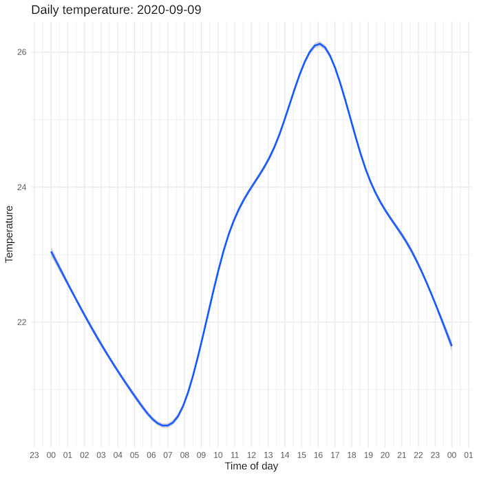

# Microbit logger

A small project to log temperature and light data from a micro:bit.

The project target is intended to be run on a raspberry pi computer with the micro:bit connected via USB.

The data is logged to a SQLite database and some small tools for retrieving and analysing the data are also included in the project.

## Getting started

First you'll need to load `microbit-serial-logger.js` onto a micro:bit.

You can do that through the [micro:bit makecode site](makecode.microbit.org).

Once that's done, we can move over to the Raspberry Pi.

Create the database:

```
python3 db-backend.py
```

This will create a SQLite database called `microbit-logger.db` into which our data will be recorded.

We're now ready to start logging data.

By deafult the micro:bit sends the temperature and light level readings over the serial connection to the Raspberry Pi every 30 seconds.

On the Raspberry Pi side, we use `read-logger.py` to read that data and write it into the database.

```
./read-logger.py
```

After the startup message, this script will also output the readings in your terminal, like this:

```
Timestamp: 2020-09-10 12:21:37
temperature: 24
light: 72
Timestamp: 2020-09-10 12:22:08
temperature: 24
light: 72
```

That's basically it on the logging side.

## Reporting

The simplest way to report on the data is to run the `temp-status.sh` script.

```
./temp-status.sh
```

Which has output like this:

```
day         min-temp    max-temp    avg-temp    min-light   max-light   num-records
----------  ----------  ----------  ----------  ----------  ----------  -----------
2020-09-05  20          23          20.8        0           2           836        
2020-09-06  20          25          22.6        0           45          2849       
2020-09-07  20          27          23.0        0           99          2800       
2020-09-08  18          25          21.4        0           74          2786       
2020-09-09  17          23          19.5        0           17          2849       
2020-09-10  18          24          21.0        0           85          2850       

Most recent record: 2020-09-10|10:40:49|24|63
```

Since this script just runs a couple of small queries against the database to produce this table and it doesn't look very exciting, I've also included a couple of extras.

The first of these is `create-chart.R`, which is an R script (So you'll need R and a couple of libraries installed) which creates a chart of yesterdays temperatures 
Since this script just runs a couple of small queries against the database to produce this table and it doesn't look very exciting, I've also included a couple of extras.

The first of these is `create-chart.R`, which is an R script (So you'll need R and a couple of libraries installed) which creates a chart of yesterdays temperatures.

Run as you would any other command line utility.

```
./create-chart.R
```

It will create the chart as a png in a subdirectory called `charts`. The chart will look something like this:



If you want to create a chart for a different day run:

```
./create-chart.R 2020-09-07
```

Swapping the ISO formatted date for one of your own choosing.

Lastly, there's `create-report.Rmd`. This is yet more R code but this one, when rendered, creates a HTML report with charts of yesterday's temperature and light levels and a HTML table with the same data as the `temp-status.sh` script.

To render the report run:

```
R -e 'rmarkdown::render("create-report.Rmd")'
```

This also needs R and a few packages installed to make it work.

